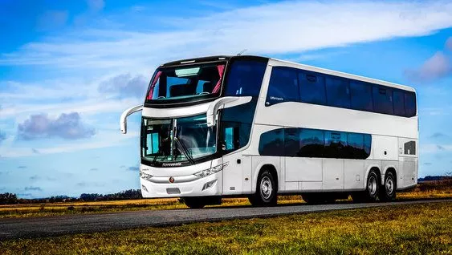

# Guía de uso de Plantuml 

## Enunciado a resolver

## Primera iteración
Una empresa de viajes muy conocida nos contrató para realiza el modelo de objetos de su compañía. 
Se quiere poder tomar registro de los distintos viajes que la empresa otorga, y poder saber qué pasajeros viajaron en cada uno y en qué transporte.

### De cada viaje se sabe
* La fecha de salida y la fecha de llegada a destino.
* El transporte en el que se desempeña. Por ahora la empresa ofrece viajes en micro.
* Los pasajeros que lo abordan.
* El origen, del que solo se conoce el nombre.
* El destino, del que solo se conoce el nombre.
Además a cada viaje se le quiere poder preguntar:
* Si está lleno, es decir que la cantidad de pasajeros que están anotados coincide con la capacidad máxima del transporte.
* Si el viaje es express. Es decir, si la fecha de salida coincide con la llegada.
* Si es un viaje de cabotaje, es decir que el destino coincide con el origen del viaje.

Se sabe que el viaje debe ser reconfigurable en el tiempo, ya que puede quedar ligado a cambios climáticos entre otras cosas.

### De los pasajeros se conoce
* Nombre y apellido
* Edad
* Sexo

### De cada micro se conoce
* El tamaño del tanque de nafta (en litros)
* La cantidad de litros de nafta que posee actualmente.
* La capacidad (cantidad máxima de pasajeros). Se sabe que los micros vienen de distintas capacidades y debe ser configurable.
Además se le quiere poder preguntar:
*  si se está quedando sin nafta, que se cumple cuando tiene menos de 10 litros.
*  si es extra large, o sea que puede llevar más de 20 pasajeros.

## Segunda iteración
La empresa se amplía, por lo que estará incorporando viajes en avión. 

### De cada avión se sabe
* El modelo, que es alfanumérico.
* El modelo de turbinas, de las que se conoce las revoluciones por minuto y el peso.
* La cantidad de turbinas que posee
Además se le quiere poder preguntar la velocidad máxima, que es de 100 veces las revoluciones por minuto de cada turbina.
Se sabe que la capacidad de todos los aviones es la misma, 150 pasajeros. Se quiere que el viaje soporte saber si está lleno teniendo en cuenta la capacidad del avión.

### además
La empresa incorporó una trafic renault para viajes cortos. De la misma solo se conoce el nombre del chofer.

## Tercera iteración
Dado el éxito que tuvo la empresa en el último fin de semana largo, decidieron incorporar distintos tipos de asientos al viaje, por lo que ahora no solo se debe registrar los pasajeros de un viaje, sino también los asientos que posee el viaje y qué pasajero ocupa cada uno.

### de los asientos sabemos que
* Tienen un número de asiento
* En caso de estar reservado, se sabe qué pasajero lo ocupa
* Se sabe si está o no disponible.
Se quiere que un asiento pueda ser reservado por un pasajero, por lo que pasa a estar no disponible. Inicialmente todos los asientos están disponibles.

### además, los asientos se dividen en categorías
1. Primera clase
  * Además se sabe la cantidad de pulgadas que tiene la TV del asiento.
  * Se sabe si el asiento tiene o no masajeador
2. Clase turista
  * Se sabe si es del lado de la ventana o del pasillo.

